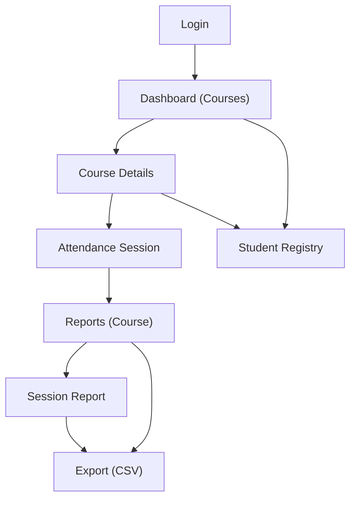

## 1. Product Overview
Redesign the existing Flask/Jinja attendance system UI to improve navigation and reporting, while preserving the current routes and templates.
Add a collapsible sidebar, a centralized student registry to assign students to courses, and improved reports with exports.

## 2. Core Features

### 2.1 User Roles
| Role | Registration Method | Core Permissions |
|------|---------------------|------------------|
| Lecturer (Admin) | Existing login form (hardcoded credentials for MVP) | Manage courses, manage students/enrollments, mark attendance, view reports, export data |

### 2.2 Feature Module
Our redesign requirements consist of the following main pages:
1. **Login**: sign-in form, error state.
2. **Dashboard (Courses)**: collapsible sidebar navigation, course list, add course.
3. **Course Details**: enrolled student list, enroll student(s), start attendance.
4. **Attendance Session**: student attendance marking, save attendance.
5. **Reports (Course)**: session list, basic filtering, export.
6. **Session Report**: per-student statuses and totals, export.
7. **Student Registry**: centralized student list, assign students to courses.

### 2.3 Page Details
| Page Name | Module Name | Feature description |
|-----------|-------------|---------------------|
| Login | Authentication | Submit username/password; show validation error; redirect to Dashboard on success. |
| Dashboard (Courses) | Collapsible sidebar | Toggle collapse/expand; highlight active page; keep content area stable. |
| Dashboard (Courses) | Course list | Display all courses; open Course Details; add a course. |
| Course Details | Enrolled students | Display students assigned to the course; link to Student Registry for assignment; add student (legacy flow remains). |
| Course Details | Attendance actions | Start/continue today’s session; navigate to Attendance Session. |
| Attendance Session | Attendance marking | Show session header; set status per student (Present/Absent/Late); submit to save. |
| Reports (Course) | Reporting overview | List sessions with date and counts; open Session Report; filter by date range. |
| Reports (Course) | Export | Export course report (CSV) for filtered range. |
| Session Report | Detail + totals | Display per-student attendance for the session; show totals by status. |
| Session Report | Export | Export session details (CSV). |
| Student Registry | Student list | List/search students; create student record once centrally. |
| Student Registry | Course assignment | Assign/unassign student(s) to courses; show current assignments per student. |

## 3. Core Process
**Lecturer flow**: Log in → view courses on Dashboard → open a course → (optionally) assign students via Student Registry → start attendance → mark and save → view course reports → drill into a session → export as needed.

