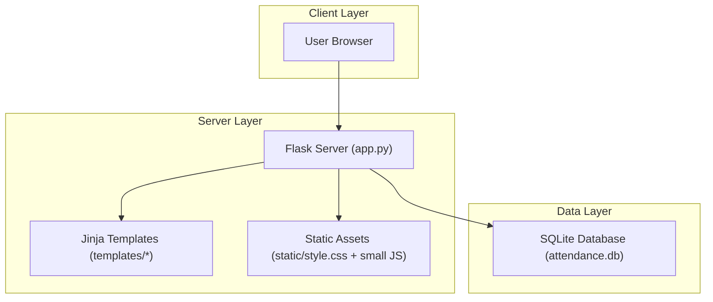
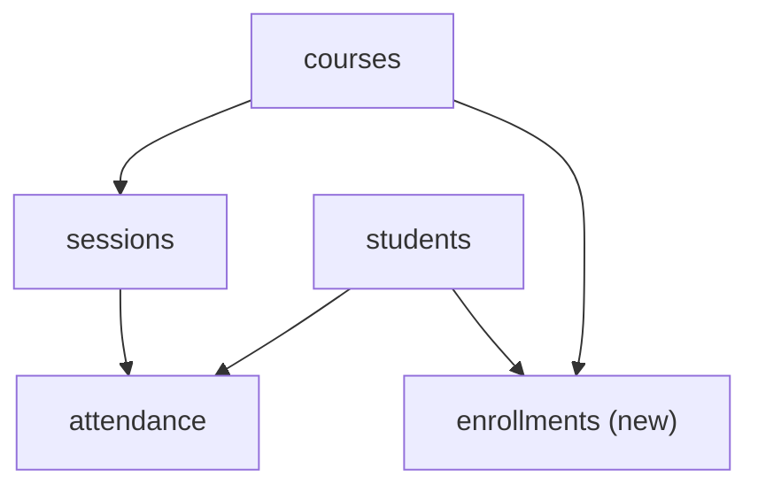

## 1.Architecture design



## 2.Technology Description

* Frontend: Server-rendered Jinja2 templates + existing CSS, plus minimal vanilla JS for sidebar collapse

* Backend: Python Flask (current app.py)

* Database: SQLite (current attendance.db)

## 3.Route definitions

| Route                                   | Purpose                                                           |
| --------------------------------------- | ----------------------------------------------------------------- |
| /login                                  | Lecturer login                                                    |
| /logout                                 | End session                                                       |
| /                                       | Dashboard: list courses                                           |
| /course/\<course\_id>                   | Course details + enrolled students                                |
| /add\_course (POST)                     | Create course                                                     |
| /add\_student/\<course\_id> (POST)      | Legacy: add student directly into a course                        |
| /start\_attendance/\<course\_id>        | Create/continue today’s session                                   |
| /attendance/\<session\_id>              | Attendance marking UI                                             |
| /save\_attendance/\<session\_id> (POST) | Persist attendance                                                |
| /reports/\<course\_id>                  | Course reporting overview                                         |
| /reports/session/\<session\_id>         | Session detail report                                             |
| /students                               | Student Registry (new; does not change existing routes/templates) |
| /students/assign (POST)                 | Assign/unassign students to courses (new)                         |
| /export/course/\<course\_id>.csv        | Export course report (new)                                        |
| /export/session/\<session\_id>.csv      | Export session report (new)                                       |

## 4.API definitions (If it includes backend services)

### 4.1 Core endpoint contracts (server-rendered, plus CSV download)

* CSV export endpoints return `text/csv` with `Content-Disposition: attachment`.

* Assign endpoint accepts form fields:

  * `student_id` (int), `course_id` (int), `action` in {"assign","unassign"}.

## 6.Data model(if applicable)

### 6.1 Data model definition



### 6.2 Data Definition Language

Tables (existing): `courses(id, course_name)`, `students(id, name, course_id)`, `sessions(id, course_id, session_date)`, `attendance(id, session_id, student_id, status)`.

New table (recommended for centralized registry while keeping code simple):

```
CREATE TABLE IF NOT EXISTS enrollments (
  id INTEGER PRIMARY KEY AUTOINCREMENT,
  student_id INTEGER NOT NULL,
  course_id INTEGER NOT NULL,
  UNIQUE(student_id, course_id)
);
CREATE INDEX IF NOT EXISTS idx_enrollments_course_id ON enrollments(course_id);
CREATE INDEX IF NOT EXISTS idx_enrollments_student_id ON enrollments(student_id);
```

Backward compatibility approach:

* Keep current pages working by treating `students.course_id` as the “primary course” (legacy), and additionally using `enrollments` for multi-course assignments.

* Optional one-time migration: insert `(student_id, course_id)` into `enrollments` for all existing students.

