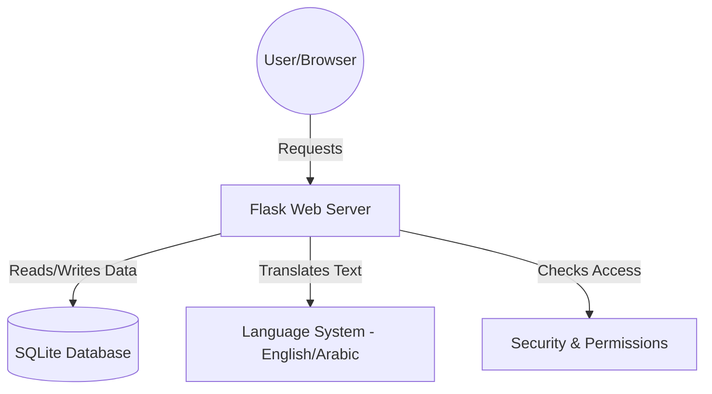
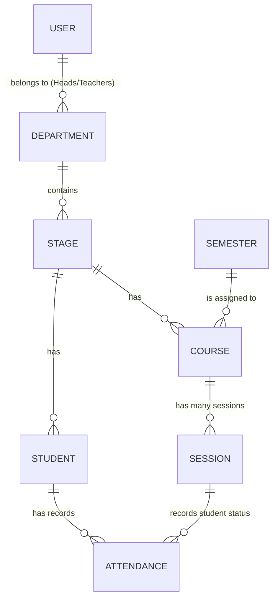
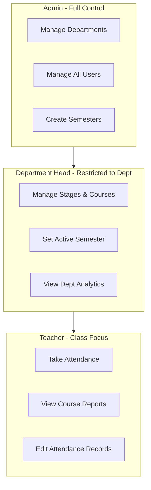
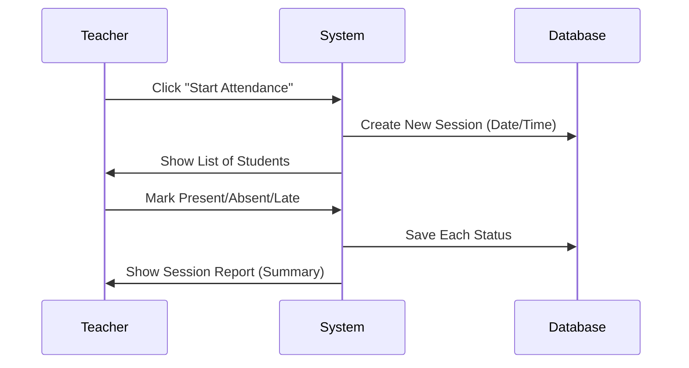
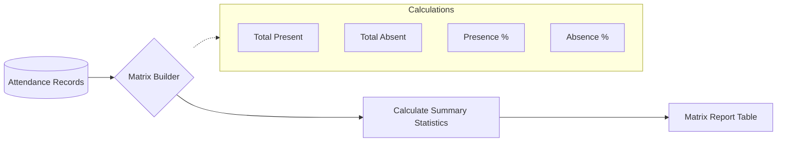
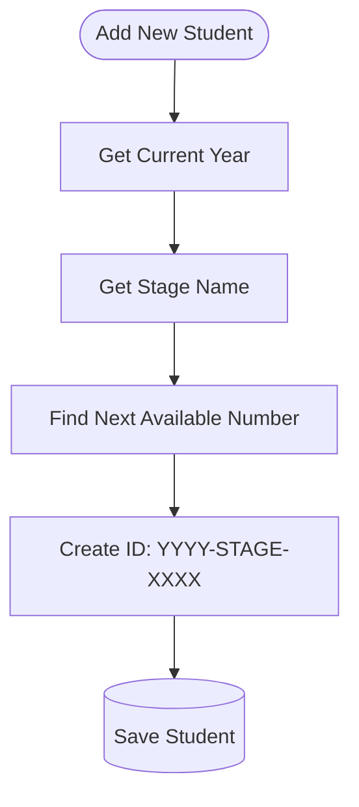
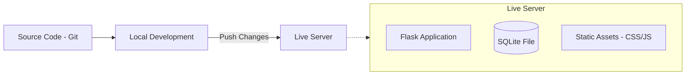

# Student Attendance System (SAS) - Documentation

This document provides a clear, visual, and simple explanation of how the Student Attendance System works. It is designed to be understood by everyone, from school administrators to technical staff.

---

## 1. High-Level System Architecture
This diagram shows the main "building blocks" of the application and how they communicate.

**Plain Language Description:**
- **User/Browser**: When you use the system on your computer or phone, you are the User. Your browser sends "requests" (like "show me the dashboard").
- **Flask Web Server**: This is the "brain" of the application. it receives your requests, performs calculations, and decides what to show you next.
- **SQLite Database**: This is the system's "memory." It safely stores all information about students, teachers, courses, and attendance.
- **Language System**: This part ensures that the entire application can be viewed in either English or Arabic.
- **Security & Permissions**: This component makes sure only authorized people can see or change specific information.

---

## 2. Database Structure (The "Memory")
This diagram shows how different types of information are linked together.

**Plain Language Description:**
- **Department**: The highest level (e.g., Computer Science).
- **Stage**: A specific level within a department (e.g., 1st Year).
- **Semester**: A specific time period (e.g., First Semester 2025).
- **Course**: A subject taught by a Teacher (e.g., Mathematics).
- **Student**: A person enrolled in a Stage.
- **Session**: A specific class occurrence (e.g., Math on April 18th).
- **Attendance**: The record of whether a student was Present, Absent, or Late for a specific session.

---

## 3. User Roles and Access Control
The system has three roles, each with different levels of authority.

**Plain Language Description:**
- **Admin**: The global manager. They set up the entire system, create departments, and manage all user accounts.
- **Department Head**: Manages everything within their own department. They can create stages and courses and decide which semester is currently active.
- **Teacher**: Focused on their assigned classes. They take daily attendance and view reports for their students.

---

## 4. The Attendance Process
This is the core activity of the system: recording who is in class.

**Plain Language Description:**
1. The **Teacher** starts a new session for their course.
2. The **System** creates a record for today and retrieves the list of students in that stage.
3. The **Teacher** marks each student (defaults to "Present" for speed).
4. The **System** saves these choices immediately to the **Database**.
5. Once finished, the teacher sees a quick summary of who was there.

---

## 5. Report Generation & Analysis
How the system turns raw data into useful reports.

**Plain Language Description:**
- The system gathers all individual attendance records for a course.
- It organizes them into a **Matrix** (a grid where rows are students and columns are sessions).
- For every student, it calculates:
    - **Total Present**: How many times they were in class.
    - **Total Absent**: How many times they missed class.
    - **Percentages**: A quick way to see their overall attendance rate at a glance.

---

## 6. Smart Student ID Generation
The system automatically assigns a unique ID to every new student.

**Plain Language Description:**
Instead of typing in IDs manually, the system creates them automatically to ensure they are unique and consistent:
- It takes the current **Year** (e.g., 2026).
- It takes the **Stage** name.
- It finds the next available sequence number (e.g., 0001, 0002).
- It combines them into a clear format: `2026-Stage1-0001`.

---

## 7. Security and Data Safety
How the system protects information.

- **Password Hashing**: We never store actual passwords. Instead, we store a "scrambled" version (hash) that is impossible to reverse.
- **Role-Based Scoping**: The system automatically filters data. For example, a Teacher can only see students in their own classes, and a Department Head can only see their own department.
- **Audit Logs**: The system records important actions (like deleting a course) so administrators can track changes.

---

## 8. Language and Accessibility
- **Dual-Language**: The entire system supports both **English** and **Arabic**. 
- **Right-to-Left (RTL)**: When Arabic is selected, the layout automatically flips to be natural for Arabic readers.
- **Mobile Friendly**: The design is "responsive," meaning it works just as well on a phone or tablet as it does on a desktop computer.

---

## 9. Deployment & Infrastructure
How the system is set up and updated.

**Plain Language Description:**
- **Source Code**: The application's "instructions" are stored in files.
- **Local Development**: Developers make and test changes on their own computers.
- **Push Changes**: Once tested, the updated instructions are sent to the **Live Server**.
- **Live Server**: This is where the application "lives" 24/7 so you can access it anytime.
- **SQLite File**: Since the database is a simple file, it is easy to back up and move.

---

## 10. Summary for Stakeholders
- **Fast**: Taking attendance for a class of 40 students takes less than 1 minute.
- **Accurate**: Attendance percentages are calculated instantly as sessions are added.
- **Secure**: Sensitive data is protected by industry-standard security practices.
- **Flexible**: Works in multiple languages and on all devices.
