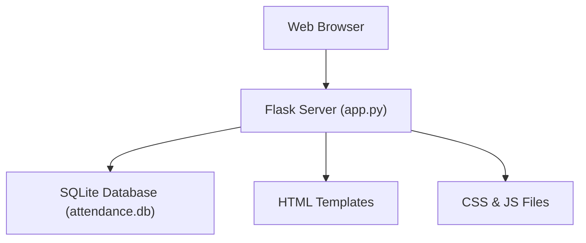
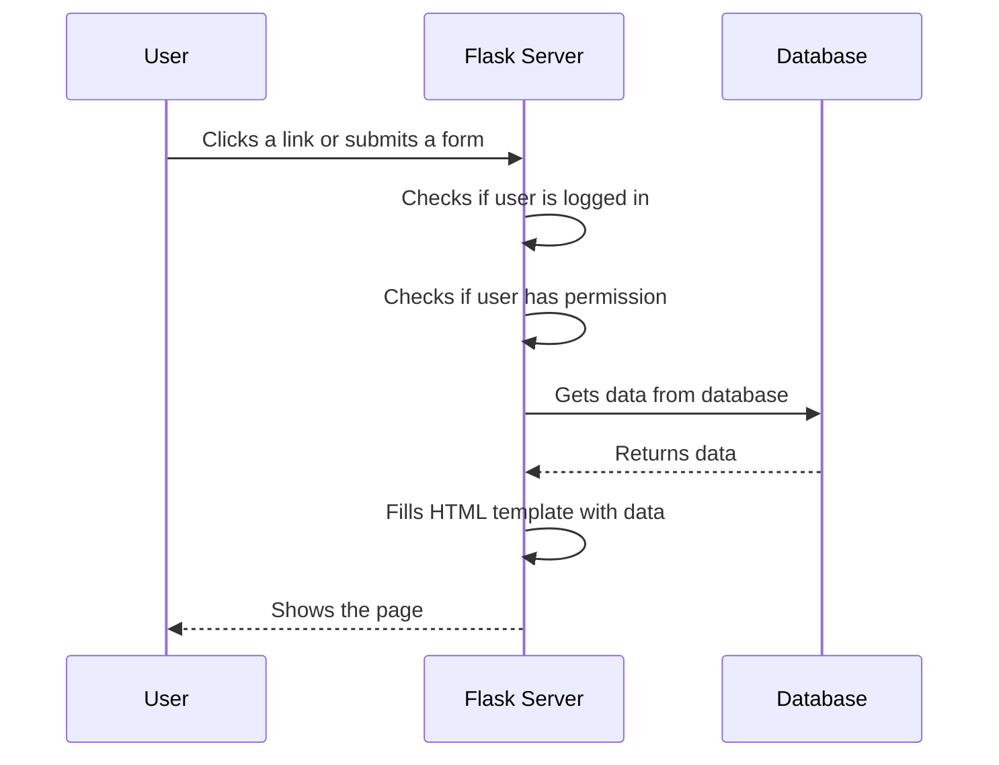
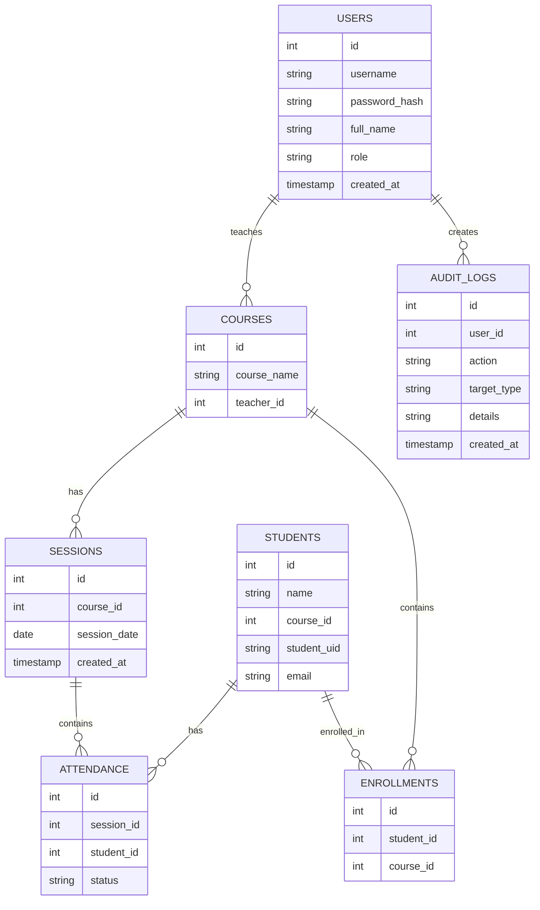
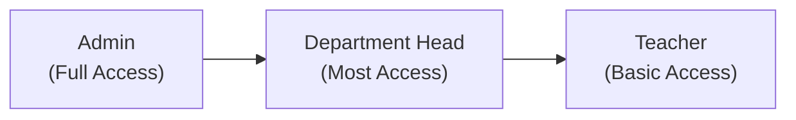
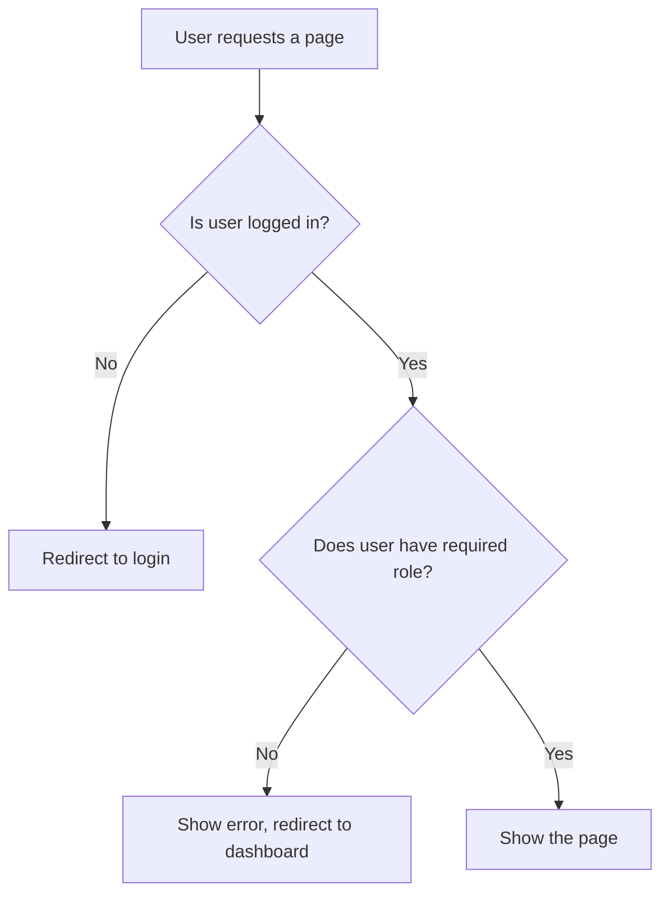
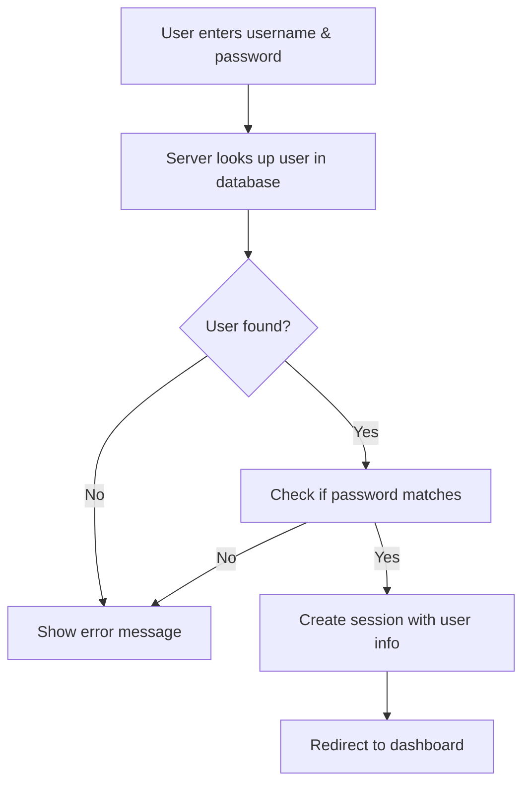
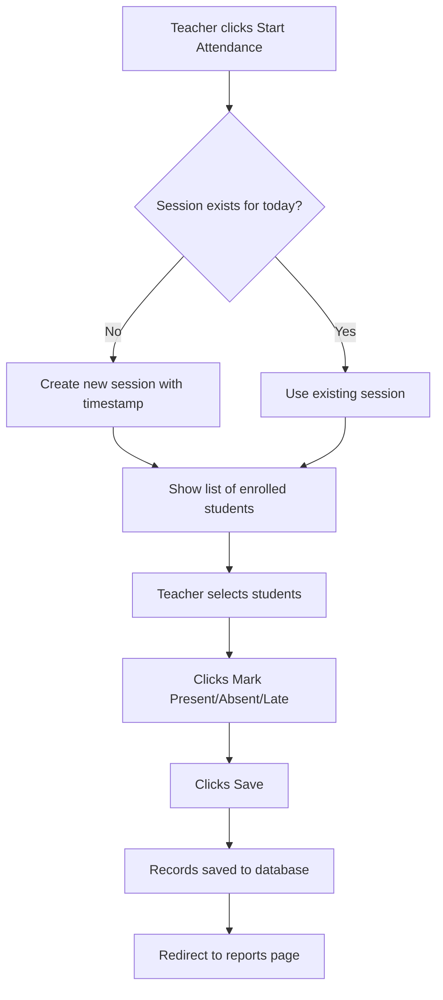
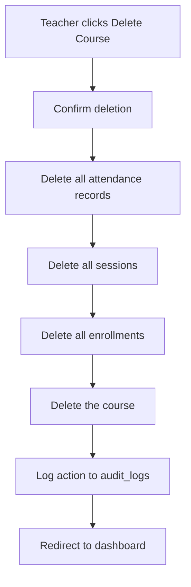
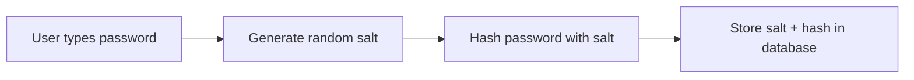

# Student Attendance Tracking System

## Graduation Project

---

## Table of Contents

1. [Project Overview](#1-project-overview)
2. [Technologies Used](#2-technologies-used)
3. [System Architecture](#3-system-architecture)
4. [Database Design](#4-database-design)
5. [Features & Routes](#5-features--routes)
6. [User Roles & Permissions](#6-user-roles--permissions)
7. [Key Workflows](#7-key-workflows)
8. [Security](#8-security)
9. [Challenges & Solutions](#9-challenges--solutions)

---

## 1. Project Overview

### What This System Does

A web application that helps teachers track student attendance for their courses. Teachers can create courses, mark attendance, and view reports with charts. Admins can manage users and students.

### Main Features

- **Login system** with different user roles (Admin, Department Head, Teacher)
- **Course management** - create, rename, and delete courses
- **Student enrollment** - assign students to courses
- **Attendance marking** - mark students as Present, Absent, or Late with bulk actions
- **Reports** - view attendance data with charts and export to CSV
- **User management** - admins can create and manage user accounts

---

## 2. Technologies Used

### Tech Stack

| Technology | Purpose |
|-----------|---------|
| **Python 3** | Backend programming language |
| **Flask** | Web framework (handles routes and pages) |
| **SQLite** | Database (stores all data in a single file) |
| **HTML/CSS** | Page structure and styling |
| **JavaScript** | Interactive features (bulk select, sidebar toggle) |
| **Jinja2** | Template engine (renders HTML with data) |
| **SVG** | Charts for reports (no external libraries needed) |

### Why I Chose These Technologies

- **Flask** is lightweight and easy to learn - good for a student project
- **SQLite** needs no setup - just a single file, perfect for demos
- **No JavaScript frameworks** - keeps things simple, no build tools needed
- **SVG charts** instead of Chart.js - works offline, no extra downloads

### Project Structure

```
SAS/
├── app.py                    # Main application (all routes and logic)
├── requirements.txt          # Python packages needed
├── attendance.db             # Database file (created automatically)
├── static/
│   ├── style.css             # All page styles
│   └── app.js                # Sidebar toggle
└── templates/
    ├── base.html             # Main layout with sidebar
    ├── login.html            # Login page
    ├── dashboard.html        # Course list
    ├── course_detail.html    # Single course page
    ├── mark_attendance.html  # Attendance marking page
    ├── reports.html          # Reports with charts
    ├── students.html         # Student list
    └── settings.html         # Admin user management
```

---

## 3. System Architecture

### How It Works



### Request Flow

When a user visits a page:



---

## 4. Database Design

### Tables Overview

The database has 7 tables:



### What Each Table Stores

| Table | What It Stores |
|-------|---------------|
| **users** | Login accounts (username, password, role) |
| **courses** | Course names and which teacher owns them |
| **students** | Student info (name, ID, email) |
| **sessions** | Attendance sessions (one per course per day) |
| **attendance** | Who was present/absent/late for each session |
| **enrollments** | Which students are in which courses |
| **audit_logs** | Record of important actions (who did what) |

---

## 5. Features & Routes

### Main Pages

| Page | URL | What It Does |
|------|-----|-------------|
| Login | `/login` | User logs in with username and password |
| Dashboard | `/` | Shows list of courses (filtered by role) |
| Course Detail | `/course/<id>` | View course info, enrolled students |
| Mark Attendance | `/attendance/<id>` | Mark students present/absent/late |
| Reports | `/reports/<id>` | View charts and attendance history |
| Students | `/students` | View and manage students |
| Settings | `/settings` | Admin page to manage users |

### Key Features Explained

**1. Bulk Attendance Marking**

Instead of marking each student one by one, teachers can:
- Select multiple students with checkboxes
- Click "Select All" to select everyone
- Click "Mark Present", "Mark Absent", or "Mark Late" to set status for all selected students

**2. Session Timestamps**

Each attendance session records when it was created, so you can see exactly when attendance was taken.

**3. Course Rename & Delete**

Teachers can rename their courses or delete them. Deleting a course also removes all related sessions, attendance records, and enrollments.

**4. CSV Export**

Attendance reports can be downloaded as CSV files to open in Excel or Google Sheets.

---

## 6. User Roles & Permissions

### Three User Roles



### What Each Role Can Do

| Feature | Admin | Dept Head | Teacher |
|---------|-------|-----------|---------|
| View all courses | Yes | Yes | Own courses only |
| Create/Rename/Delete courses | Yes | Yes | Yes (own only) |
| Create students | Yes | Yes | No |
| Enroll students in courses | Yes | Yes | No |
| Mark attendance | Yes | Yes | Yes |
| View reports & export CSV | Yes | Yes | Yes |
| Manage user accounts | Yes | No | No |

### How Role Checking Works



Each role has a level number:
- **Teacher** = Level 1
- **Department Head** = Level 2
- **Admin** = Level 3

When a page requires a certain role, the system checks if the user's level is high enough.

---

## 7. Key Workflows

### Login Flow



### Attendance Marking Flow



### Course Delete Flow



---

## 8. Security

### Password Protection

Passwords are never stored as plain text. They are hashed using **PBKDF2** (a secure hashing algorithm):



When logging in:
1. Get the stored hash from database
2. Extract the salt from it
3. Hash the entered password with the same salt
4. Compare the two hashes

### SQL Injection Prevention

All database queries use **parameterized queries** (using `?` placeholders):

```python
# Safe - uses parameterized query
conn.execute('SELECT * FROM users WHERE username = ?', (username,))

# Dangerous - never do this
conn.execute(f"SELECT * FROM users WHERE username = '{username}'")
```

### Session-Based Login

After logging in, Flask stores user info in a session cookie. Every protected page checks if the session exists before showing content.

---

## 9. Challenges & Solutions

### Challenge 1: Database Lock Errors

**Problem:** When restarting the app, SQLite would sometimes lock the database file.

**Solution:** Made sure to close database connections after every query using `conn.close()`.

### Challenge 2: Role-Based Access Control

**Problem:** Teachers shouldn't be able to create students, but the feature was available to everyone.

**Solution:** Added role checks in two places:
- **Backend:** Routes check user role before allowing actions
- **Frontend:** Hide buttons and forms that the user shouldn't see

### Challenge 3: Bulk Attendance Marking

**Problem:** Marking each student one by one was slow.

**Solution:** Added checkboxes and JavaScript to update multiple students at once. The JavaScript updates the dropdown values, then the form submits all at once.

### Challenge 4: Session Timestamps

**Problem:** Needed to track when each attendance session was created.

**Solution:** Added a `created_at` column to the sessions table. For existing databases, added a migration that adds the column if it doesn't exist.

---

## Demo Accounts

| Username | Password | Role |
|----------|----------|------|
| admin | admin123 | Admin |
| dept_head | head123 | Department Head |
| teacher1 | teacher123 | Teacher |
| teacher2 | teacher123 | Teacher |

---

## How to Run

1. Install dependencies: `pip install -r requirements.txt`
2. Run the app: `python app.py`
3. Open browser: `http://127.0.0.1:5000`
4. Login with any demo account above
